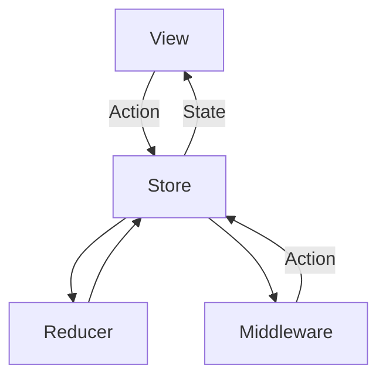

# Buscador

Buscador es una pequeña app que permite buscar productos usando la API de Mercado Libre. 

| Buscardor | Resultado | Detalle Producto |
|----------|:-------------:|------|
|  |   |    |

--- 

# API

Se utilizaron algunos de los endpoints de esta lista https://developers.mercadolibre.com.ar/es_ar/items-y-busquedas

Salvo por el de categoría, no logre que ninguno me funcionará sin token. Generé uno y lo hardcodee para poder realizar las llamadas.

Endpoints usados:
* Busqueda: https://api.mercadolibre.com/sites/MLA/search?q=test&offset=0&limit=50
* Descripción: https://api.mercadolibre.com/items/MLA1473971735/description
* Imagenes: https://api.mercadolibre.com/items/MLA1473971735


---
# Arquitectura de la aplicación 

Para el desarrollo de la aplicación

Se uso Swift y SwiftUI. Teniendo en cuenta que SwiftUI es declarativo en función de un estado se elegió un Redux como patrón de arquitectura, el flujo para actualizar un estado es unidireccinal y hay una única source of truth del estado de la app, el `State`. También se uso Combine para el manejo de tareas asincronicas. 


___
# REDUX

Se explica de manera breve la implementción de cada uno de sus sus componente.

## `State`
Es la única source of truth y representa el estado actual de la aplicación en un momento determinado. El `State` es definido en un struct.

```swift
struct AppState {
    var alertErrorMessage: String? = nil
    var homeRouteStack: [Route] = []
    ...
    var xxx: XX
}
```

### Mejoras en `State`
Cuando el `State` comience a crecer lo mejor es separarlo en varios struct. Puede ser pantallas ó funcionalidad.

```swift
struct AppState {
    var navigationState = NavigationState() 
    var searchResultState = SearchResultState()
    ...
    ...
    var xxxState = XxxState()
}

struct NavigationState {
    var homeRouteStack: [Route] = []
    ...
    var xxx: XXX
}

struct SearchState {
    var query = ""
    var isValidQuery = false
    var queryError: String? = nil
}
```


## `Action`
Todo interación del usuario de disparar un `Action`. Las `Action` son definidas como un enum con un case para para una de las acciones que serán disparadas dentro de la app.

```swift
enum AppAction {
    case clearError
    case showError(String)

    case navigation(NavigationAction)
    ...
    case actionN
}
```
### Mejoras en `Action`
A medida que crece la app la cantidad de `Action` también, por eso el siguiente paso es separarlas en diferentes enums y agruparos dentro del `AppAction`


```swift
enum AppAction {
    case navigation(NavigationAction)
    case search(SearchAction)
    ...
    case actionN
}

enum NavigationAction {
    case navigateTo(Route)
    case back
    ...
    case actionN
}

enum SearchAction {
    case updateSearchText(String)
    ...
    case actionN
}
```

## `Store`
Es el encargado de almacenar el estado de la app, recibe las `Actions` y se encarga de que los `Reducers` las procesen y que le devuelvan un nuevo `State` para finalmente notificarle a la `View` de que hay nuevo `State`y que debe actualizarse. 

```swift
final class Store<State, Action>: ObservableObject {
    @Published private(set) var state: State
    
    private let reducer: Reducer<State, Action>
    let middlewares: [Middleware<State, Action>]
    private var middlewareCancellables: Set<AnyCancellable> = []

    func dispatch(_ action: Action) {
        ...
    }
}
```


## `Reducer`
Es quien recibe del `Store` un `Action` y un `State`, en funcion de los últimos aplica la lógica de negocio y modifica el `State`.

```swift
let appReducer: Reducer<AppState, AppAction> = { state, action in
    switch action {
        case .navigation(let navigationAction):
            navigationReduce(&state, navigationAction)
        case .clearError:
            state.alertErrorMessage = nil
        case .acctionXXX:
            state.xxx = xxx
    }
}
```

### Mejoras en `Reducer`
La lógica asociada a cada `Action` puede ser mucha, y al haber muchas de ellas, el  `switch` se vuelve rápidamente muy dificil de leer. Para evitar esto, se propone separar en `Reducer` principal en multiples `Reducer` teniendo en cuenta la división de `AppAction` mencionada anteriormente. Y el proceso de cada `Action` se mueve a una función especifica para ella.


```swift
let appReducer: Reducer<AppState, AppAction> = { state, action in
    switch action {
        case .navigation(let navigationAction):
            navigationReduce(&state, navigationAction)
        case .search(let searchAction)
           searchReducer(&state, searchAction)
        ...
        ...
        case .xxx(let xxxAction):
           xxxReducer(&state, xxxAction)       
    }
}

let appReducer: Reducer<AppState, AppAction> = { state, action in
    switch action {
        case .navigation(let navigationAction):
            navigationReduce(&state, navigationAction)
        case .search(let searchAction)
           searchReducer(&state, searchAction)
        ...
        ...
        case .xxx(let xxxAction):
           xxxReducer(&state, xxxAction)       
    }
}


let navigationReduce: Reducer<AppState, NavigationAction> = { state, action in
    switch action {
        case .navigateTo(let route):
            processNavigateTo(state, action)
        case .goBack:
            processGoBack(state, action)
        ...
        ...
    }
}

func processNavigateTo(state, action) {
    state.homeRouteStack.append(route)
    switch route {
        case .productDetail(let product):
        state.searchResultState.productDetailState = ProductDetailState(product: product)
        case .searchResult(let query):
        state.searchResultState = SearchResultState(query: state.searchState.query)
        default:
        break
    }
}
```

## `Middlewawre`
Es el encargado de inteceptar las `Action` y realizar el efecto de lado (Ej: logging, las llamadas a la API). También puede disparar nuevas `Action`.

Por ejemplo este middlewares se encarga de iniciar una llamada a la API.

```swift
let productDetailMiddleware: Middleware<AppState, AppAction> = { state, action in
    
    @Inject var productsRepository: ProductsRepositoryProtocol
    
    switch action {
    case  .fetchProductDescription:
        return productsRepository.getProductDescription(productId: state.searchResultState.productDetailState.product!.id)
                    .map { description in
                        return .fetchProductDescriptionSuccess(description)
                    }
                    .catch { error in
                        return Just(.fetchProductsFailure(error.localizedDescription))
                    }
                    .eraseToAnyPublisher()
    ...
    }   
}
```

---

# Pendientes
* Manejo de caso de una busqueda sin resultado
* Manejo de errores en la pantalla del detalel de producto


