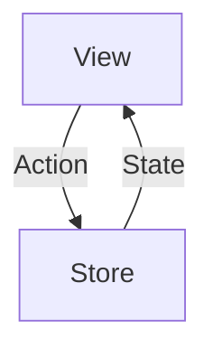

# Buscador

Buscador es una pequeña app que permite buscar productos usando la API de Mercado Libre. 

| Buscardor | Resultado | Detalle Producto |
|----------|:-------------:|------|
|  |   |    |

# Arquitectura de la aplicación 

Para el desarrollo de la aplicación

Se uso Swift y SwiftUI. Teniendo en cuenta que SwiftUI es declarativo en función de un estado se elegió un Redux como patrón de arquitectura, el flujo es para actualizar un estado es unidireccinal y hay una source of thruth para en estado

