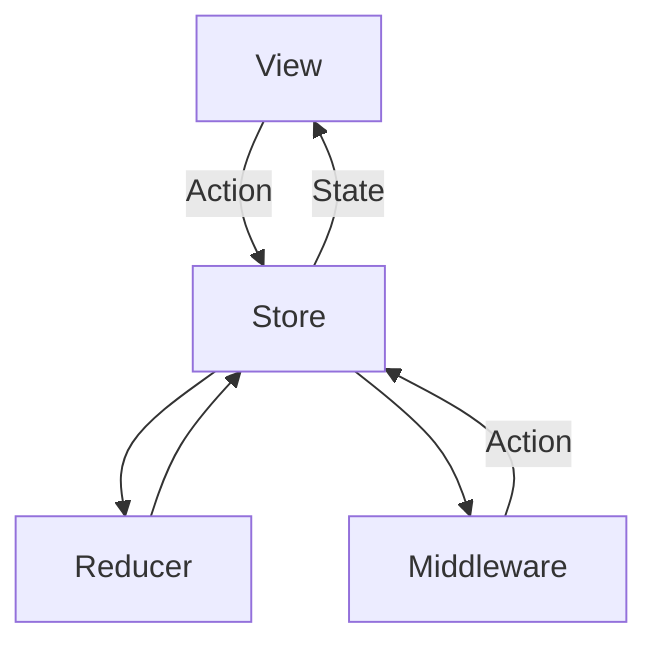

# Buscador

Buscador es una pequeña app que permite buscar productos usando la API de Mercado Libre. 

| Buscardor | Resultado | Detalle Producto |
|----------|:-------------:|------|
|  |   |    |

# Arquitectura de la aplicación 

Para el desarrollo de la aplicación

Se uso Swift y SwiftUI. Teniendo en cuenta que SwiftUI es declarativo en función de un estado se elegió un Redux como patrón de arquitectura, el flujo para actualizar un estado es unidireccinal y hay una única source of truth del estado de la app, el `State`


___
# REDUX

Se explica de manera breve la implementción de cada uno de sus sus componente.

## `State`
Es la única source of truth y representa el estado actual de la aplicación en un momento determinado. El `State`es definido en un struct.

```swift
struct AppState {
    var alertErrorMessage: String? = nil
    var homeRouteStack: [Route] = []
    ...
    var xxx: XX
}
```

### Mejoras en `State`
Cuando el `State` comience a crecer lo mejor es separarlo en varios struct. Puede ser pantallas ó funcionalidad.

```swift
struct AppState {
    var navigationState = NavigationState() 
    var searchResultState = SearchResultState()
    ...
    ...
    var xxxState = XxxState()
}

struct NavigationState {
    var homeRouteStack: [Route] = []
    ...
    var xxx: XXX
}

struct SearchState {
    var query = ""
    var isValidQuery = false
    var queryError: String? = nil
}
```


## `Action`
Todo interación del usuario de disparar un `Action`. Las `Action` son definidas como un enum con un case para para una de las acciones que serán disparadas dentro de la app.

```swift
enum AppAction {
    case clearError
    case showError(String)

    case navigation(NavigationAction)
    ...
    case actionN
}
```
### Mejoras en `Action`
A medida que crece la app la cantidad de `Action` también, por eso el siguiente paso es separarlas en diferentes enums y agruparos dentro del `AppAction`


```swift
enum AppAction {
    case navigation(NavigationAction)
    case search(SearchAction)
    ...
    case actionN
}

enum NavigationAction {
    case navigateTo(Route)
    case back
    ...
    case actionN
}

enum SearchAction {
    case updateSearchText(String)
    ...
    case actionN
}
```


